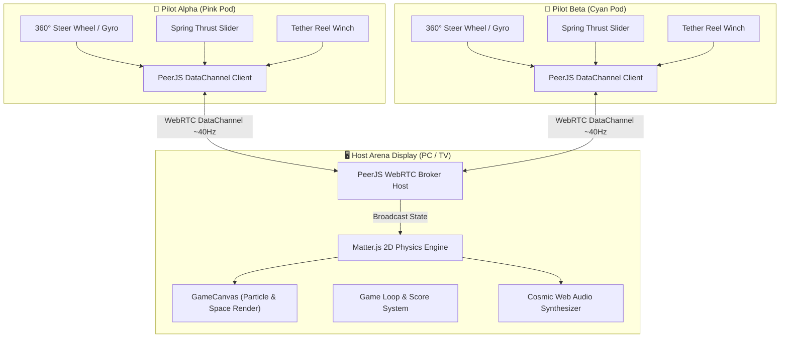

# 🚀 AstroTether (アストロテザー)

> **2-Player Local Co-Op Space Odyssey with Physics-Based WebRTC Dual-Screen Controls.**

[](https://react.dev/)
[](https://www.typescriptlang.org/)
[](https://vitejs.dev/)
[](https://tailwindcss.com/)
[](https://brm.io/matter-js/)
[](https://peerjs.com/)
[](LICENSE)

---

## 🌟 Overview

**AstroTether** adalah game *local multiplayer space navigation* berestetika **Cyberpunk Retro-SciFi**. Dua pemain (Pilot Alpha & Pilot Beta) mengemudikan dua wahana antariksa yang terhubung oleh sebuah **tali fisik elastis (*tether constraint*)**. 

Gameplay terbagi dalam konfigurasi **Dual-Screen**:
1. **Host Arena Display (PC / Laptop / Smart TV)**: Menampilkan arena kosmik luas beresolusi penuh, simulasi fisika *real-time*, efek partikel, audio dinamis, dan navigasi misi.
2. **Mobile Cockpit Controllers (Smartphones)**: Setiap pemain menggunakan ponsel mereka sebagai *flight controller* nirkabel yang terhubung langsung melalui **WebRTC DataChannels** dengan *latency* ultra-rendah tanpa instalasi aplikasi tambahan.

---

## 🎮 Fitur Utama

- 📱 **Zero-Install Controller**: Masuk ke kokpit secara instan cukup dengan memindai **QR Code** di layar host atau membuka URL portal `/join`.
- ⚡ **Real-time WebRTC Peer-to-Peer**: Input kontrol dikirim langsung antar-perangkat pada frekuensi ~40Hz tanpa membebani server pusat.
- 🪢 **Realistic Constraint Physics (Matter.js)**: Tali tether memiliki elastisitas, *spring stiffness*, dan momen inersia nyata yang memungkinkan manuver akrobatik seperti **Orbital Slingshot** dan **Tether Whip**.
- 🕹️ **Tactile Cockpit Flight Controls**:
  - **360° Rotational Steer Wheel**: Kemudi analog progresif dengan pelacakan delta relatif (bebas benturan sudut pertama sentuh) dan pembatasan rotasi realistis ($\pm 150^\circ$).
  - **Vertical Spring Thrust Slider**: Tuas akselerasi vertikal yang otomatis kembali ke posisi *idle* (0%) saat dilepas untuk kendali dorongan yang presisi.
  - **Tether Reel-In Winch**: Tombol aksi untuk menarik dan memperpendek jarak kabel demi momentum putaran tinggi.
  - **Sync Dash / Boost**: Pemicu pendorong darurat berkecepatan tinggi saat kedua pilot perlu menghindari rintangan kosmik.
  - **Gyroscope Motion Steering**: Opsi kemudi opsional menggunakan sensor kemiringan (*accelerometer/gyro*) smartphone dengan cakrawala buatan (*artificial horizon*).
  - **Haptic Vibration Feedback**: Getaran taktil saat menabrak asteroid, menarik tali, atau mengaktifkan booster.
- 🎨 **Visual Cyberpunk Berkelas**: Palette warna neon tailwind v4 (`neon-cyan`, `neon-pink`, `neon-yellow`, `space-navy`), tipografi futuristik *Orbitron* & *Rajdhani*, serta animasi ambient glow.
- 🌐 **Bilingual (ID / EN)**: Dukungan multi-bahasa instan (Indonesia & English) pada antarmuka Host dan Controller.

---

## 🛰️ Arsitektur Sistem



---

## 🕹️ Panduan Kontrol Kokpit

| Kontrol | Tipe | Fungsi |
| :--- | :--- | :--- |
| **Steering Wheel** | Touch Drag (360°) | Memutar arah haluan pesawat dengan putaran halus dan tingkat belok progresif. |
| **Thrust Slider** | Vertical Drag | Mengatur daya dorong roket ($0\% - 100\%$). Otomatis kembali ke $0\%$ saat dilepas. |
| **Reel Tether** | Hold Button | Menarik kabel untuk memperpendek jarak dengan rekan, melipatgandakan gaya sentripetal. |
| **Sync Dash** | Tap Button | Mengaktifkan akselerasi instan bertenaga tinggi untuk lolos dari gravitasi lubang hitam. |
| **Gyroscope Toggle**| Switch Button | Mengalihkan mode setir antara sentuhan tangan (*Touch*) dan kemiringan fisik HP (*Motion*). |
| **Swap Pod** | Quick Action | Bertukar peran kapal antara Pilot Alpha (Pink) dan Pilot Beta (Cyan) tanpa *reconnect*. |

---

## 🚀 Panduan Memulai (Quick Start)

### 1. Prasyarat
- [Node.js](https://nodejs.org/) versi 18.0 ke atas.
- Ponsel dan PC terhubung ke jaringan **Wi-Fi / Hotspot yang sama**.

### 2. Instalasi
```bash
# Clone repositori
git clone https://github.com/username/astrotheter.git
cd astrotheter

# Install dependensi
npm install
```

### 3. Menjalankan Server Lokal
Jalankan Vite dengan flag `--host` agar server dapat diakses oleh perangkat lain di jaringan lokal:
```bash
npm run dev -- --host
```

Terminal akan menampilkan URL jaringan lokal, misalnya:
```
  ➜  Local:   http://localhost:5173/
  ➜  Network: http://192.168.1.100:5173/
```

### 4. Mulai Bermain
1. Buka `http://localhost:5173` di browser komputer/laptop utama Anda dan pilih **"HOST GAME"**.
2. Di layar host akan muncul **Room Code** beserta **QR Code**.
3. Ambil smartphone Pemain 1 dan Pemain 2:
   - **Metode A**: Buka kamera HP dan scan QR Code di layar host.
   - **Metode B**: Buka `http://<IP-HOST>:5173/#/join` (atau langsung scan via kamera) dan masukkan Room Code secara manual atau gunakan kamera pemindai internal web.
4. Ketika kedua pilot terhubung, layar host akan otomatis membuka arena antariksa!

---

## 🛠️ Tech Stack

| Kategori | Teknologi | Deskripsi |
| :--- | :--- | :--- |
| **Frontend Framework** | [React 19](https://react.dev/) + [TypeScript](https://www.typescriptlang.org/) | Reaktivitas UI modern dengan tipe data yang ketat. |
| **Build Tool** | [Vite 8](https://vitejs.dev/) | Bundler generasi baru berkecepatan tinggi dengan HMR instan. |
| **Styling** | [Tailwind CSS v4](https://tailwindcss.com/) | Engine utility-first CSS performa tinggi dengan native CSS variables theme tokens. |
| **Physics Simulation** | [Matter.js](https://brm.io/matter-js/) | Mesin fisika 2D rigid body untuk kalkulasi tumbukan dan kabel tether. |
| **Networking** | [PeerJS](https://peerjs.com/) (WebRTC) | Abstraksi WebRTC P2P DataChannels untuk komunikasi multi-device berkecepatan tinggi. |
| **QR Code Engine** | [qrcode.react](https://github.com/zpao/qrcode.react) + [jsQR](https://github.com/cozmo/jsQR) | Pembuatan QR di Host dan pemindaian kamera langsung di Controller. |
| **Icons** | [Phosphor Icons](https://phosphoricons.com/) | Koleksi ikon futuristik yang fleksibel dan konsisten. |

---

## 📁 Struktur Direktori

```
astrotheter/
├── public/                 # Aset statis & audio audio synthesizer
├── src/
│   ├── components/         # Komponen UI modular
│   │   ├── AstroLogo.tsx       # Logo neon SVG animasi
│   │   ├── GameCanvas.tsx      # Core render loop Matter.js & canvas grafis
│   │   ├── LanguageSelector.tsx# Komponen pemilih bahasa ID / EN
│   │   ├── QrScannerModal.tsx  # Pemindai kamera QR berbasis jsQR
│   │   └── ShipPreview.tsx     # Pratinjau 3D/2D lambung kapal antariksa
│   ├── context/
│   │   └── LanguageContext.tsx # Manajemen state terjemahan i18n
│   ├── views/              # Halaman utama aplikasi
│   │   ├── ControllerView.tsx  # UI Kokpit smartphone (Steer wheel, slider, reel)
│   │   ├── HostView.tsx        # Layar display arena host & lobi WebRTC
│   │   ├── JoinView.tsx        # Portal masuk mobile dengan scan QR & input kode
│   │   └── WelcomeView.tsx     # Landing page & penentu peran (Host/Join)
│   ├── utils/              # Helper jaringan WebRTC, sound fx, & kalkulasi
│   ├── App.tsx             # Root router & inisialisasi aplikasi
│   ├── index.css           # Konfigurasi Tailwind v4 theme & custom utilities
│   └── main.tsx            # Entry point React
├── index.html              # HTML shell & font definitions
├── package.json            # Daftar dependensi & npm scripts
└── README.md               # Dokumentasi proyek
```

---

## 📄 Lisensi

Proyek ini dirilis di bawah lisensi **MIT**. Silakan gunakan, pelajari, dan kembangkan secara bebas.
